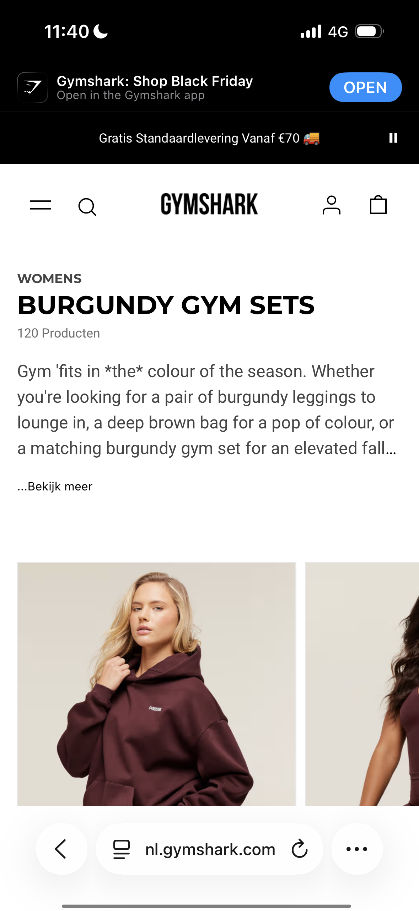
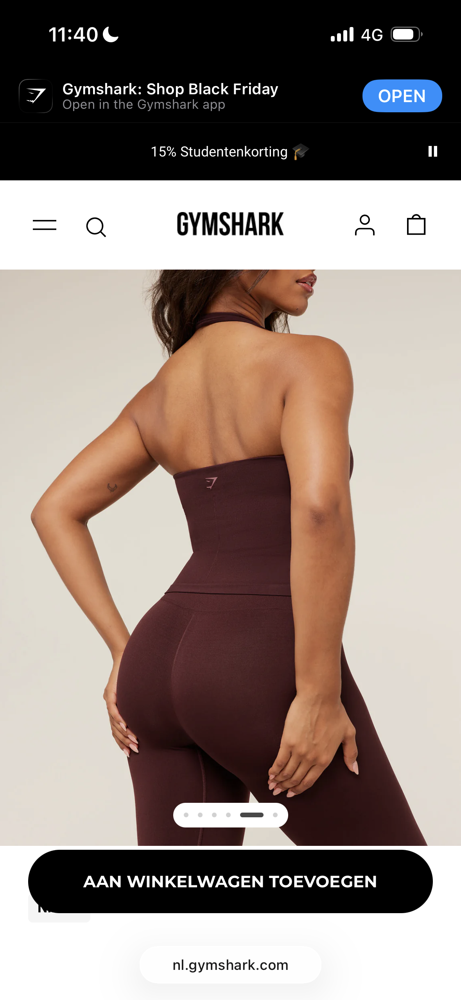

# Procesverslag
Markdown is een simpele manier om HTML te schrijven.  
Markdown cheat cheet: [Hulp bij het schrijven van Markdown](https://github.com/adam-p/markdown-here/wiki/Markdown-Cheatsheet).

Nb. De standaardstructuur en de spartaanse opmaak van de README.md zijn helemaal prima. Het gaat om de inhoud van je procesverslag. Besteedt de tijd voor pracht en praal aan je website.

Nb. Door *open* toe te voegen aan een *details* element kun je deze standaard open zetten. Fijn om dat steeds voor de relevante stuk(ken) te doen.

## Jij

  
uitwerken voor kick-off werkgroep

  ### Auteur:
  Alicia Jong (500951903)

  #### Je startniveau:
  Blauw

  #### Je focus:
  Voor nu kies ik ervoor om te focussen op de surface plane, maar misschien zie ik dat veranderen naarmate we de lessen hebben gehad
 

## Je website

  
uitwerken voor kick-off werkgroep

  ### Je opdracht:
  Gymshark - https://nl.gymshark.com/?gclsrc=aw.ds&gad_source=1&gad_campaignid=11606057178&gbraid=0AAAAADMZ0ipTagoWTB6cEOTM6RLbv9VzN&gclid=CjwKCAiAlMHIBhAcEiwAZhZBUpz2wwijXT8EkKItPLwLDe4meeg5Z8840-szMd-WMekeNnX5Hl5IuBoCAM0QAvD_BwE

  #### Screenshot(s) van de eerste pagina (small screen): 
  Burgundy gym sets pagina
  

  #### Screenshot(s) van de tweede pagina (small screen):
  Detailpagina burgundy gym sets
  
 

## Toegankelijkheidstest 1/2 (week 1)

  
uitwerken na test in 2e werkgroep

  ### Bevindingen
  Lijst met je bevindingen die in de test naar voren kwamen:

## Breakdownschets (week 1)

  
uitwerken na afloop 3e werkgroep

  ### de hele pagina: 
  

  ### dynamisch deel (bijv menu): 
  

  ### wellicht nog een dynamisch deel (bijv filter): 
  

## Voortgang 1 (week 2)

  
uitwerken voor 1e voortgang

  ### Stand van zaken
  De afgelopen week heb ik niet veel kunnen doen, omdat ik veel afwezig was vanwege het ziek zijn. Hierdoor moet ik nog beginnen aan mijn HTML-bestand en de oefeningen. Ik ga hiervoor een plan opstellen om ervoor te zorgen dat ik bij het volgende voortgangsgesprek weer op schema lig met het lesplan.

  ### Agenda voor meeting
  Voordat we ons voortgangsgesprek hadden, hebben we een groepsapp aangemaakt en besproken hoe we het gesprek wilden laten verlopen. We hebben kort overlegd wie de meeste vragen had en wie daarom als eerste aan de beurt zou gaan om zijn of haar proces toe te lichten. Daarnaast, het indien mogelijk was, ook het HTML-bestand laten zien en de website die ieder van ons zou gaan uitwerken.

  | Charlotte              | Julia                  | Nomi                   | Valerie                |
  | ---                    | ---                    | ---                    | ---                    |
  | Haar proces bespreken  | Haar proces bespreken  | Haar proces bespreken  | Haar proces bespreken  |
  | en ook vragen stellen  | en ook vragen stellen  | en ook vragen stellen  | en ook vragen stellen  |
  | die voor haar relevant | die voor haar relevant | die voor haar relevant | die voor haar relevant |
  | zijn                   | zijn                   | zijn                   | zijn                   |

  ### Verslag van meeting
  Tijdens het voortgangsgesprek heb ik verteld wat mijn huidige stand van zaken is en heb ik mijn website laten zien die ik voor dit vak wil gaan maken. We zijn samen de verschillende pagina’s doorgelopen en ik heb vragen gesteld die relevant zijn voor het opzetten van mijn HTML-bestand. Verder heb ik meegeluisterd met de rest van mijn groepje en aantekeningen gemaakt die voor mij duidelijk en bruikbaar zijn om verder te komen en om aan de eisen te voldoen. De lijst met aantekeningen staat hieronder:

  - Oefeningen doen om mijn kennis te verbreden
  - HTML-bestand opzetten
  - Afbeelding plaatsen in de H1 mag
  - Homepage-logo gebruiken als H1
  - Section gebruiken aan het einde van een type onderdeel
  - DIV alleen gebruiken voor vormgeving, dit geldt ook voor classes
  - Classes aanmaken voor de eerste of tweede pagina
  - Navigatie (NAV) in de header plaatsen
  - Container gebruiken als section voor een nieuw gedeelte
  - Alle linkjes naar beide pagina’s doorzetten
  - Link vormgeven als button
  - Input type instellen op email zodat het toetsenbord wordt aangepast
  - Overige logo’s op de pagina alleen als link gebruiken
  - Titels altijd tonen of visual hidden toepassen, voorkeur is tonen
  - Unordered list binnen een section plaatsen
  - Lege alt aanmaken betekent dat er geen alt wordt gebruikt
  - Tijdens het maken van de breakdown schets overbodige elementen verwijderen

## Voortgang 2 (week 3)

  
uitwerken voor 2e voortgang

  ### Stand van zaken
  De afgelopen week heb ik niet veel kunnen doen door privéomstandigheden. Ik ben wel aan de slag gegaan met mijn HTML-bestand voor één pagina, maar heb verder nog niet meer kunnen doen.

  ### Agenda voor meeting
  Voordat we ons voortgangsgesprek hadden, hebben we in onze groepsapp besproken hoe we het gesprek wilden laten verlopen. We hebben kort overlegd hoe we het zouden aanpakken en wie als eerste aan de beurt zou zijn om zijn of haar proces toe te lichten.

  | Charlotte              | Julia                  | Nomi                   | Valerie                |
  | ---                    | ---                    | ---                    | ---                    |
  | Haar proces bespreken  | Haar proces bespreken  | Haar proces bespreken  | Haar proces bespreken  |
  | en ook vragen stellen  | en ook vragen stellen  | en ook vragen stellen  | en ook vragen stellen  |
  | die voor haar relevant | die voor haar relevant | die voor haar relevant | die voor haar relevant |
  | zijn                   | zijn                   | zijn                   | zijn                   |

  ### Verslag van meeting
  Tijdens het voortgangsgesprek heb ik verteld wat mijn huidige stand van zaken is en heb ik een klein gedeelte van mijn HTML laten zien. Ook heb ik vragen gesteld die relevant waren voor het opzetten van mijn HTML-bestand.Verder heb ik meegeluisterd met de rest van mijn groepje en aantekeningen gemaakt die voor mij duidelijk en bruikbaar zijn om verder te komen en om aan de eisen te voldoen. De lijst met aantekeningen staat hieronder:

  - Span gebruiken in de H1 voor “women”
  - Section, unordered lists (ul), headings en overige paragrafen
  - Klikbare elementen niet volledig als een a-tag maken
  - JavaScript gebruiken voor muistracking
  - Hovering met display none of met de has-selector
  - CodePen-opdrachten nakijken
  - HTML volledig afronden zodat er met CSS begonnen kan worden
  - Geen li gebruiken zonder ul

## Toegankelijkheidstest 2/2 (week 4)

  
uitwerken na test in 9e werkgroep

  ### Bevindingen
  Lijst met je bevindingen die in de test naar voren kwamen (geef ook aan wat er verbeterd is):

## Voortgang 3 (week 4)

  
uitwerken voor 3e voortgang

  ### Stand van zaken
  hier dit ging goed & dit was lastig (neem ook screenshots op van delen van je website en code)

  ### Agenda voor meeting
  samen met je groepje opstellen

  | student 1      | student 2          | student 3    | student 4        |
  | ---            | ---                | ---          | ---              |
  | dit bespreken  | en dit             | en ik dit    | en dan ik dat    |
  | en dat ook nog | dit als er tijd is | nog een punt | dit wil ik zeker |
  | ...            | ...                | ...          | ...              |

  ### Verslag van meeting
  hier na afloop snel de uitkomsten van de meeting vastleggen

  - punt 1
  - punt 2
  - nog een punt
  - ...

## Eindgesprek (week 5)

  
uitwerken voor eindgesprek

  ### Je uitkomst - karakteristiek screenshots:
  

  ### Dit ging goed/Heb ik geleerd: 
  Korte omschrijving met plaatjes

  

  ### Dit was lastig/Is niet gelukt:
  Korte omschrijving met plaatjes

  

## Bronnenlijst

  
continu bijhouden terwijl je werkt

  Nb. Wees specifiek ('css-tricks' als bron is bijv. niet specifiek genoeg). 
  Nb. ChatGpT en andere AI horen er ook bij.
  Nb. Vermeld de bronnen ook in je code.

  1. https://developer.mozilla.org/en-US/docs/Web/HTML/Reference/Elements/summary
  2. https://developer.mozilla.org/en-US/docs/Web/CSS/Reference/Selectors/Pseudo-classes
  3. https://developer.mozilla.org/en-US/docs/Web/HTML/Reference/Elements/details
  4. 
  5. 
  6. 
https://alvarotrigo.com/blog/hamburger-menu-css/

